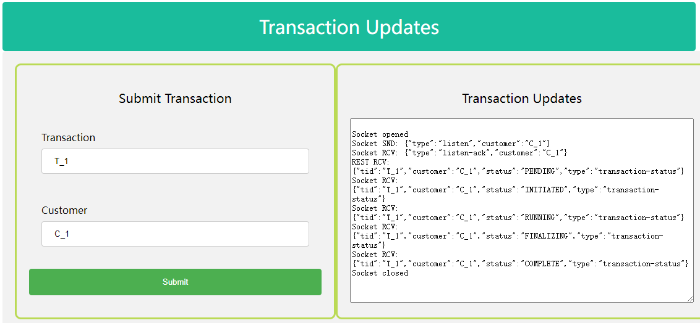

# 用Vert.X WebSockets进行响应式应用程序开发

> 项目地址: 

## 处理长时间运行的操作

大多数 Web API 都是为执行简单的 CRUD 操作而开发的。 API 执行的大多数操作本质上都是阻塞的，尤其是查询数据库、通过消息服务与其他服务通信。 传入请求由线程提供服务，该线程执行安全和授权检查、输入完整性检查、检查业务规则和执行数据事务等。 客户端期望这些操作在请求的范围内完成，响应将指示操作的成功或失败。

有时，我们的任务是在前端构建功能，其中包括调用 API 来执行可能需要超过合理时间的操作。 操作可能无法在请求超时内完成，然后 API 将发送响应以在关闭请求之前指示操作的当前状态。 因此，前端需要实现一种机制来查询操作的当前状态，以了解操作何时完成。 或者应用程序的用户需要重新加载应用程序的视图来了解当前状态。


应用程序的这种设计不仅增加了后端的负载以响应轮询请求以查询先前操作的状态，而且前端应用程序需要在其代码中添加轮询机制。

如果我们可以使用推送机制将前端设计为对后端事件做出更快速响应，那将是有益的。这种方法将通过让用户参与提供最新的信息，为构建丰富的用户体验打开大门。启用推送机制将减少后端的流失，以支持获取各种业务操作的当前状态。

在本文中，我们将探讨如何使用 WebSocket 来实现到达前端的实时更新，以提供事务的最新状态。

在查看参考实现之前，让我们熟悉一下将用于构建示例应用程序的技术。

# 关于 Vert.x

Vert.x 是一个工具包，用于创建在 Java 虚拟机（JVM）上运行的响应式、非阻塞和异步应用程序。它包含多个组件，可帮助您创建反应式应用程序。它被设计为云原生。

由于 Vert.x 支持异步应用程序，因此它可用于创建具有大量消息、大型事件处理、HTTP 交互等的应用程序。


Vert.x Core API 包含用于编写 Vert.x 应用程序的骨干，以及对 HTTP、TCP、UDP、文件系统、异步流和许多其他构建块的低级支持。它也被 Vert.x 的许多其他组件使用。

# 警告

Vert.x API 是非阻塞的，不会阻塞事件循环，但如果您自己在处理程序中阻塞事件循环，那也没有多大帮助。

如果你这样做，那么事件循环在被阻塞时将无法做任何其他事情。 如果您阻止 Vertx 实例中的所有事件循环，那么您的应用程序将完全停止！

阻塞的例子包括：

1. Thread.sleep()

   线程休眠

2. Waiting on a lock

   等待锁

3. Waiting on a mutex or monitor (e.g. synchronized section)

   等待互斥锁或监视器（例如同步部分）

4. Doing a long lived database operation and waiting for a result

   执行长期数据库操作并等待结果

5. Doing a complex calculation that takes some significant time.

   进行需要大量时间的复杂计算。

6. Spinning in a loop

   在循环中旋转

# 关于 WebSockets

WebSocket 是一种通信协议，通过单个 TCP 连接提供全双工通信通道。当前允许 Web 应用程序使用此协议的 API 规范称为 WebSockets。

WebSocket 不同于 HTTP。 这两种协议都位于 OSI 模型的第 7 层，并依赖于第 4 层的 TCP。尽管它们不同，但 RFC 6455 声明 WebSocket“旨在通过 HTTP 端口 443 和 80 工作，并支持 HTTP 代理和中介” ，从而使其与 HTTP 兼容。 为了实现兼容性，WebSocket 握手使用 HTTP Upgrade 标头从 HTTP 协议更改为 WebSocket 协议。


WebSocket 协议支持在 Web 浏览器（或其他客户端应用程序）和 Web 服务器之间进行交互，其开销低于半双工替代方案（如 HTTP 轮询），从而促进了与服务器之间的实时数据传输。

此外，WebSocket 在 TCP 之上启用消息流。

# 示例应用程序

为了展示 Vert.x 的强大功能和 WebSocket 带来的灵活性，我们将使用 Vert.x HTTP Server 在 JVM 上编写一个非常简单的 Web 应用程序。下图将描述我们的示例应用程序的外观：


# 构建 Verticles

Verticles 是由 Vert.x 部署和运行的代码块。 一个 Vert.x 实例默认维护 N 个事件循环线程（其中 N 默认为 core*2）。 Verticles 可以用 Vert.x 支持的任何语言编写，单个应用程序可以包含用多种语言编写的 Verticles。

这是一个示例verticle：

```java
public class MyVerticle extends AbstractVerticle {

 // Called when verticle is deployed
 public void start() {
 }

 // Optional - called when verticle is undeployed
 public void stop() {
 }

}
```

让我们完成创建 HTTP 服务器以处理 REST 和 WebSockets 传入请求的步骤。 我们将从定义一个 HTTP 路由器对象开始，以处理传入的 REST 请求。

```java
// 创建一个router对象
m_router = Router.router(vertx);
// 一个简单的transaction端点
m_router.get("/api/transaction/:customer/:tid").handler(this::handleTransaction);
// 提供静态内容（如 HTML 和 JS 文件）的处理程序
m_router.route("/static/*").handler(StaticHandler.create());
....
....
// 创建 HTTP 服务器
vertx.createHttpServer()
    .requestHandler(m_router)
    .listen(
            // Retrieve the port from the
            // configuration, default to 8080.
            port,
            result -> {
                if (result.succeeded()) {
                    m_logger.info("Listening now on port {}", port);
                    // Initialize application
                } else {
                    m_logger.error("Failed to listen", result.cause());
                }
            }
    );
```

Now that we defined a basic HTTP Server to process incoming HTTP requests, we are going to add a handler to process incoming WebSocket requests. In order to make the creation and use of WebSockets more easier on the client, we are going to use a popular WebSockets based JS library called SockJS.

# SockJS是什么?

现在我们定义了一个基本的 HTTP 服务器来处理传入的 HTTP 请求，我们将添加一个处理程序来处理传入的 WebSocket 请求。 为了在客户端更轻松地创建和使用 WebSockets，我们将使用一个流行的基于 WebSockets 的 JS 库: `SockJS`。

让我们定义 SockJS 处理程序来处理传入的 WebSocket 请求：

```java
// 创建一个SockJS处理器.
SockJSHandlerOptions options = new SockJSHandlerOptions()
        .setHeartbeatInterval(2000)
        .setRegisterWriteHandler(true); // We need an identifier
SockJSHandler ebHandler = SockJSHandler.create(vertx, options);

// 我们的websocket端点: /eventbus/
m_router.route("/eventbus/*").subRouter(ebHandler.socketHandler(sockJSSocket -> {
    // 提取标识符
    final String id = sockJSSocket.writeHandlerID();
    // 创建一个对象来映射客户端套接字
    ClientConnection connection = new ClientConnection(id, sockJSSocket, vertx.eventBus());
    // 跟踪打开的连接
    m_client_connections.put(id, connection);
    // 注册结束回调
    sockJSSocket.endHandler((Void) -> {
        connection.stop();
        m_client_connections.remove(id);
    });
    // 开始连接
    connection.start();
}));
```

我们现在将实现我们的 REST 端点处理程序。 为了保持我们的应用程序不阻塞，我们将在主事件循环之外使用一个 worker verticle 来处理请求。 该请求将使用 EventBus 上的消息转发给 worker。

```java
private void handleTransaction(RoutingContext rc) {
    // 抓取请求和响应对象
    HttpServerResponse response = rc.response();
    // 提取参数
    String customer = rc.pathParam("customer");
    String tid = rc.pathParam("tid");

    // 构建消息以发送给worker
    JsonObject requestObject = new JsonObject();
    requestObject.put("tid", tid);
    requestObject.put("customer", customer);
    requestObject.put("status", TransactionStatus.PENDING.value());
    
    // 通过事件总线向worker发送消息
    // 指定一个处理程序来处理从worker返回的响应
    vertx.eventBus().request("WORKER", requestObject.encode(), result -> {
        if (result.succeeded()) {
            String resp = result.result().body().toString();
            // 如果响应过早关闭
            if (response.closed() || response.ended()) {
                return;
            }
            // 将响应发送给客户端
            response
                    .setStatusCode(201)
                    .putHeader("content-type",
                            "application/json; charset=utf-8")
                    .end(resp);
        } else {
            if (response.closed() || response.ended()) {
                return;
            }
            response
                    .setStatusCode(404)
                    .putHeader("content-type",
                            "application/json; charset=utf-8")
                    .end();
        }
    });

}
```

现在我们已经定义了主 Verticle，带有 HTTP 服务器和端点处理程序，我们现在将继续定义我们的 worker Verticle 来处理请求。

我们将定义一个简单的 worker，它在具有不同状态的计时器上生成事务更新。 每个状态转换都将通过事件总线公布，以便侦听器在必要时接收和处理更新。

```java
public class ApiWorkerVerticle extends AbstractVerticle {
    ...
    @Override
    public void start() throws Exception {
        ...
        // 获取应用配置
        ConfigRetriever retriever = ConfigRetriever.create(vertx,
                new ConfigRetrieverOptions().addStore(fileStore));
        retriever.getConfig(
                config -> {
                    // 一旦我们有了配置就开始初始化
                    startup(config.result());
                }
        );
    }

    private void startup(JsonObject config) {
        // 处理应用程序配置
        processConfig(config);
        // 创建我们的事件总线监听器。
        // 我们将接收此消费者的处理程序从主 Verticle 发送的所有请求
        worker_consumer = vertx.eventBus().consumer("WORKER");
        worker_consumer.handler(m -> {
            handleRequest(m);
        });
    }

    @Override
    public void stop() throws Exception {
        ...
    }
}
```

我们使用事件总线侦听器定义了我们的 worker  Verticle。 侦听器将接收从 ApiVerticle 发送的所有请求。 处理程序将在收到每个请求时对其进行处理。

```java
private void handleRequest(Message<String> m) {
    // Extract the payload from the message
    JsonObject requestObject = new JsonObject(m.body());
    final String tid = requestObject.getString("tid");
    activeTransactions.put(tid, requestObject);
    // Prepare and respond to the request, before we process the request.
    requestObject.put("status", TransactionStatus.PENDING.value());
    requestObject.put("type", "transaction-status");
    m.reply(requestObject.encode());
    // process the transaction
    handleTransaction(tid);
}
```

我们的事务处理非常简单。 我们将使用一个计时器为交易生成不同状态的及时更新。

```java
private void handleTransaction(final String tid) {
        // 设置一个 5 秒的定时器
        vertx.setTimer(5000, x -> {
            updateTransaction(tid);
        });
    }

    // 事务的各种状态
    public enum TransactionStatus {
        PENDING("PENDING"),
        INITIATED("INITIATED"),
        RUNNING("RUNNING"),
        FINALIZING("FINALIZING"),
        COMPLETE("COMPLETE");
        ...
    }
```

每次计时器触发时，我们都会更新事务的状态，并通过事件总线发布更新。 一旦我们达到最终状态，我们将从跟踪中删除活动事务。

```java
private void updateTransaction(final String tid) {
    // 获取事务
    JsonObject requestObject = activeTransactions.get(tid);
    if (requestObject != null) {
        TransactionStatus status = TransactionStatus.valueOf(requestObject.getString("status"));
        if (status.ordinal() < TransactionStatus.COMPLETE.ordinal()) {
            TransactionStatus nextStatus = TransactionStatus.values()[status.ordinal() + 1];
            // 准备更新消息
            requestObject.put("status", nextStatus.value());
            requestObject.put("type", "transaction-status");
            // 发送前保存
            activeTransactions.put(tid, requestObject);
            // 通过事件总线发布更新
            publishTransaction(requestObject);
            if (nextStatus.ordinal() < TransactionStatus.COMPLETE.ordinal()) {
                // 如果我们不处于终端状态，则安排下一次更新
                handleTransaction(tid);
            } else {
                // 如果我们达到了终止状态，则删除事务
                activeTransactions.remove(tid);
            }
        }
    }
}

private void publishTransaction(final JsonObject obj) {
    // 在 CUSTOMER 主题上发布消息，只有对此 CUSTOMER 事件感兴趣的听众才会收到此消息
    vertx.eventBus().publisher(obj.getString("customer")).write(obj.encode());
}
```

我们现在有必要的组件来处理传入的事务请求，在 worker 中处理它，并通过事件总线发布更新。 我们现在需要为有兴趣了解这些更新的客户创建一个表示。 我们将定义一个连接对象来表示客户端通过 WebSocket 的持久连接。 此连接对象将通过事件总线为 CUSTOMER 主题创建侦听器，并将接收到的所有事件通过 WebSocket 传送到客户端。

```java
public class ClientConnection {

        public ClientConnection(final String writeHandlerID,
                                final SockJSSocket socket,
                                final EventBus eventBus)
        {
            // Save the socket and the socket identifier
            this.id = writeHandlerID;
            this.socket = socket;
            // We will use the event bus to listen to updates
            // published by the worker verticle for a CUSTOMER
            this.eventBus = eventBus;
        }

        // Attach a handler to process messages received from the client
        public void start() {
            socket.handler(
                buffer -> {
                    String message = buffer.toString();
                    handleMessage(message);
                }
            );
        }
    }
```

由于我们不希望始终拥有持久的 WebSocket 连接，因此我们将创建它并仅在事务请求的时间跨度内使用它。

```java
private void handleMessage(final String messageStr) {
        JsonObject messageObj = new JsonObject(messageStr);
        String messageType = messageObj.getString("type");
        // 当客户端发送“listen”请求时，我们将设置监听器
        if (messageType.equalsIgnoreCase("listen")) {
            setupListener(messageObj.getString("customer"));
        }
    }

    private void setupListener(final String customer) {
        // 为 CUSTOMER 主题创建事件总线消费者
        if (consumer == null) {
            consumer = eventBus.consumer(customer);
            consumer.handler(event -> {
                // 将传入的事件总线消息传递给客户端
                socket.write(event.body());
            });
        }
        // 为监听请求发送 ACK
        JsonObject obj = new JsonObject();
        obj.put("type", "listen-ack");
        obj.put("customer", customer);
        sendMessage(obj.encode());
    }

    private void sendMessage(final String message) {
        socket.write(message);
    }
```

我们现在有一个可用的 API 来处理传入的 HTTP 和 WebSocket 请求。 现在让我们创建能够发出 HTTP 请求以及在事务处理期间打开 WebSocket 连接的客户端。

```java
    // 定义socket对象
    var socket = null;

    function openSocket() {
        // Open a socket
        socket = new SockJS("/eventbus/");
        socket.onopen = function () {
            listen();
        };
        // 定义一个处理程序来处理传入的消息
        socket.onmessage = function(msg) {
            processMessage(msg.data);
        };
        ...
    }

    function closeSocket() {
        socket.close();
        socket = null;
    }

    function submitTransaction() {
        // 在我们提交事务之前打开套接字
        // 打开套接字后，我们将进行 HTTP REST 调用
        openSocket();
    }

    // 发送一个请求来监听更新
    function listen() {
        var message = {};
        message.type = "listen";
        message.customer = document.getElementById("customer-value").value;
        sendMessage(JSON.stringify(message));
    }

    function sendMessage(msg) {
        socket.send(msg);
    }

    function processMessage(msg) {
        var obj = JSON.parse(msg);
        if (obj.type === 'listen-ack') {
            handleListenAck(obj);
        } else if (obj.type === 'transaction-status') {
            handleTransactionStatus(obj);
        }
    }

    function handleListenAck(obj) {
        // 进行 API 调用
        sendTransaction();
    }

    function handleTransactionStatus(obj) {
        if (obj.status === 'COMPLETE') {
            closeSocket();
        }
    }

    // REST 请求
    function sendTransaction() {
        var cid = document.getElementById("customer-value").value;
        var tid = document.getElementById("transaction-value").value;
        let xmlHttpReq = new XMLHttpRequest();
        xmlHttpReq.onreadystatechange = function () {
            if (xmlHttpReq.readyState === 4 && (xmlHttpReq.status === 200 || xmlHttpReq.status === 201))
                display("REST RCV: " + xmlHttpReq.responseText);
        }
        xmlHttpReq.open("GET", "http://localhost:8080/api/transaction/" + cid + "/" + tid, true); // true for asynchronous
        xmlHttpReq.send(null);
    }
```

我们现在有一个 JS 前端，它可以通过 HTTP 发出事务请求，并在事务处理期间通过 WebSocket 侦听事务更新。

可以在此 [演示](https://github.com/pvub/demos/tree/master/ReactiveLongRunning) 中找到完整的工作示例。


# 如果运行示例程序
## 构建
```bash
gradlew clean build -x test
```

## 运行
```bash
java -Dreactiveapi.config=conf/config.json -jar build/libs/ReactiveLongRunning-1.0-fat.jar
```

## 使用
用浏览器打开: http://localhost:8080/static/index.html
指定事务ID和客户ID，然后提交。

最后运行结果如下图所示:



------

<<<<<< [完] >>>>>>
