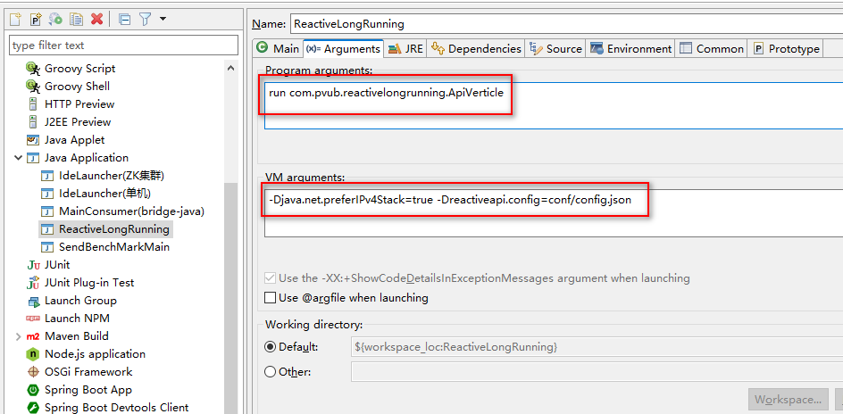

# Eclipse debug setup

## Main:

**Project:** `ReactiveLongRunning`

**Main class:** `io.vertx.core.Launcher`

## Arguments:

**Program arguments:** `run com.pvub.reactivelongrunning.ApiVerticle`

**VM arguments:** `-Djava.net.preferIPv4Stack=true -Dreactiveapi.config=conf/config.json`

------

<<<<<< [完] >>>>>>

